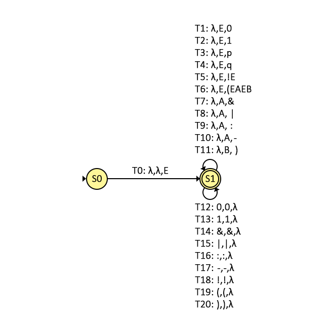

# Logical2pci
This projects aims to receive an logical expression and, after some steps, convert this into pcode instructions.

# Steps
1. Catch the logical expression from input;
2. Running it in a pushdown automata;
3. Use result of step 2 to build a binary tree;
4. Run postorder transversal at btree to build reverse polish notation;
5. Convert RPN into valid Pcode instructions;
6. Run pcode and then generate output file;

# Grammar (Greibach normal form)
```
E -> 0 | 1 | p | q | !E | (EAEB
A -> & | | | : | - 
B -> )
```
Note: Your program do not assign value to p and q, althought accept it.

# Pushdown Automata


# Compilation
> gcc -o teste ada2asa.c pcode.c rpn2pci.c btree2rpn.c pushdown.c main.c

# Running example
> ./teste "(1&(0|1))"

# Assumption
* For sucessful conversion the user must provide a balanced logical expression.

# Accepted symbols and your semantic
| Logical Symbol | Your Program | Semantic |
|--- | --- |----|
| ^ | & |AND
| v | \| |OR
| ¬ | ! |NOT
| ->| : |IMPLICATION 
|<->| \- |BICONDITIONAL
| F |  0  | FALSE
| T |  1  | TRUE

# Examples
See  and  file on repo.
